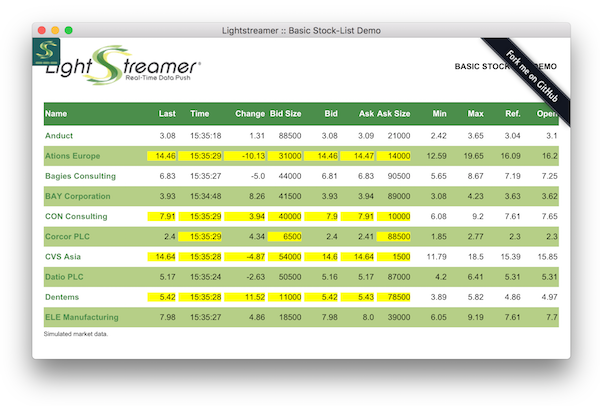

# Lightstreamer - Basic Stock-List Demo - Electron client
<!-- START DESCRIPTION lightstreamer-example-stocklist-client-javascript-basic-stock-list-demo---electron-client -->

This project contains a demo client showing integration between Lightstreamer JavaScript Client library and Electron

## Live Demo

[](http://demos.lightstreamer.com/StockListDemo_Basic)<br>
###[ View live demo](http://demos.lightstreamer.com/StockListDemo_Basic)<br>

## Details

This demo displays real-time market data for ten stocks, generated by a feed simulator.<br>
This app uses the <b>JavaScript Client API for Lightstreamer</b> to handle the communications with Lightstreamer Server. A simple user interface is implemented to display the real-time data received from Lightstreamer Server. The front-end code is kept extremely simple and represents a good introduction to Lightstreamer subscription management. In particular, the client code can be considered as a reference example of item subscriptions in MERGE mode.

The demo includes the following client-side functionalities:
* A [Subscription](http://www.lightstreamer.com/docs/client_javascript_uni_api/Subscription.html) containing 10 items, subscribed to in <b>MERGE</b> mode feeding a [StaticGrid](http://www.lightstreamer.com/docs/client_javascript_uni_api/StaticGrid.html).

<!-- END DESCRIPTION lightstreamer-example-stocklist-client-javascript-basic-stock-list-demo---electron-client -->

## Install

If you want to install a version this demo pointing to your local Lightstreamer Server, follow these steps:

* Note that, as prerequisite, the [Lightstreamer - Stock- List Demo - Java Adapter](https://github.com/Lightstreamer/Lightstreamer-example-Stocklist-adapter-java) has to be deployed on your local Lightstreamer Server instance. Please check out that project and follow the installation instructions provided with it.
* Launch Lightstreamer Server.
* Get the `lightstreamer.js` file from the [Lightstreamer 5 Colosseo distribution](http://www.lightstreamer.com/download) and put it in the `src/StockListDemo_Basic/js` folder of the demo (if that is the case, please create it). Alternatively, you can build a `lightstreamer.js` file from the
  [online generator](http://www.lightstreamer.com/docs/client_javascript_tools/generator.html).
  In that case, be sure to include the LightstreamerClient, Subscription, StaticGrid and StatusWidget modules and to use the "Use AMD" version.
* Get the `require.js` file form [requirejs.org](http://requirejs.org/docs/download.html) and put it in the `src/StockListDemo_Basic/js` folder of the demo.
* From command line go into `Lightstreamer-example-StockList-client-electron` folder and run ```npm install```.

The demo is now ready to be launched with ```npm start```.

## Build

To build your own version of the demo app, instead of using the one provided in the deploy.zip file from the Install section above, follow these steps:

* Install ```Electron Packager``` by running ```npm install electron-packager -g```.
* From command line go into `Lightstreamer-example-StockList-client-electron` folder and run ```electron-packager <sourcedir> <appname> --platform=<platform> --arch=<arch> --version=<Electron version> [optional flags...]``` specifying right parameters ([more info](https://www.npmjs.com/package/electron-packager)).

For instance a build for the OS X x64 platform can be done by running:<br>
```cmd
electron-packager . BasicStockListDemo --platform=darwin --arch=x64 --version=0.35.6
```

## See Also

### Lightstreamer Adapters Needed by These Demo Clients
<!-- START RELATED_ENTRIES -->

* [Lightstreamer - Stock-List Demo - Java Adapter](https://github.com/Lightstreamer/Lightstreamer-example-Stocklist-adapter-java)
* [Lightstreamer - Reusable Metadata Adapters - Java Adapter](https://github.com/Lightstreamer/Lightstreamer-example-ReusableMetadata-adapter-java)

<!-- END RELATED_ENTRIES -->

### Related Projects

* [Lightstreamer - Stock-List Demos - HTML Clients](https://github.com/Lightstreamer/Lightstreamer-example-StockList-client-javascript#basic-stock-list-demo---html-client)
* [Lightstreamer - Basic Stock-List Demo - jQuery (jqGrid) Client](https://github.com/Lightstreamer/Lightstreamer-example-StockList-client-jquery)
* [Lightstreamer - Stock-List Demo - Dojo Toolkit Client](https://github.com/Lightstreamer/Lightstreamer-example-StockList-client-dojo)
* [Lightstreamer - Stock-List Demos - Flex Clients](https://github.com/Lightstreamer/Lightstreamer-example-StockList-client-flex)
* [Lightstreamer - Basic Stock-List Demo - Java SE (Swing) Client](https://github.com/Lightstreamer/Lightstreamer-example-StockList-client-java)
* [Lightstreamer - Basic Stock-List Demo - .NET Client](https://github.com/Lightstreamer/Lightstreamer-example-StockList-client-dotnet)

## Lightstreamer Compatibility Notes

* Compatible with Lightstreamer JavaScript Client library version 6.0 or newer.
