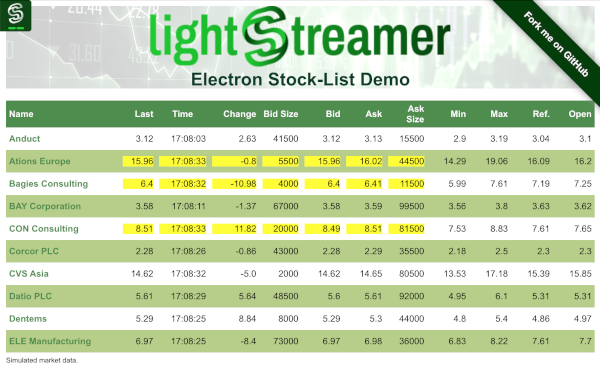

# Lightstreamer - Basic Stock-List Demo - Electron Client
<!-- START DESCRIPTION lightstreamer-example-stocklist-client-javascript-basic-stock-list-demo---electron-client -->

This project contains a demo application showing the integration between the Lightstreamer JavaScript Client library and Electron.

## Live Demo

<br>
### [ View OS X live demo ](http://demos.lightstreamer.com/StockListDemo_Electron/deploy-darwin-x64.zip)<br> [ View Windows live demo](http://demos.lightstreamer.com/StockListDemo_Electron/deploy-win32-x64.zip)<br> [ View Linux live demo](http://demos.lightstreamer.com/StockListDemo_Electron/deploy-linux-x64.zip)
(download the platform source zip; unzip it; launch "lightstreamer-basic-stock-list-demo" executable.)

## Details

This demo displays real-time market data for ten stocks generated by a feed simulator and is based on [Basic Stock-List Demo](https://github.com/Lightstreamer/Lightstreamer-example-StockList-client-javascript#basic-stock-list-demo---html-client). <br>
This project shows how is it possible to integrate the <b>JavaScript Client API for Lightstreamer</b> into <b>Electron</b>, in order to quickly create cross-platform desktop apps embedding real-time web technologies.

If you want to go deeper into Electron, check out the [Electron site](http://electron.atom.io).

<!-- END DESCRIPTION lightstreamer-example-stocklist-client-javascript-basic-stock-list-demo---electron-client -->

## Install

If you want to install a version of this demo pointing to your local Lightstreamer Server, create a local clone of this repository on your computer and follow these steps:

* If you don't have [npm](https://github.com/npm/npm) installed on your system, please install it.
* Note that, as prerequisite, the [Lightstreamer - Stock- List Demo - Java Adapter](https://github.com/Lightstreamer/Lightstreamer-example-Stocklist-adapter-java) has to be deployed on your local Lightstreamer Server instance. Please check out that project and follow the installation instructions provided with it.
* Launch Lightstreamer Server.
* Get the `lightstreamer.min.js` file from [npm](https://www.npmjs.com/package/lightstreamer-client-web) or [unpkg](https://unpkg.com/lightstreamer-client-web/lightstreamer.min.js) and put it in the `src/StockListDemo_Basic/js` folder of the demo (if that is the case, please create it).
  Alternatively, you can generate a customized lightstreamer.min.js library containing only the classes you actually use;
  see the build instructions on the [GitHub page](https://github.com/Lightstreamer/Lightstreamer-lib-client-javascript#building).
  In that case, be sure to include the LightstreamerClient, Subscription, StaticGrid and StatusWidget modules.
* Get the `require.js` file from [requirejs.org](http://requirejs.org/docs/download.html) and put it in the `src/StockListDemo_Basic/js` folder of the demo.
* From command line go into the `Lightstreamer-example-StockList-client-electron` folder and run ```npm install```.

The client demo configuration assumes that Lightstreamer Server, Lightstreamer Adapters, and this client are launched on the same machine. If you need to target a different Lightstreamer server, please search this line:
```js
var lsClient = new LightstreamerClient(protocolToUse+"//localhost:"+portToUse,"DEMO");
```
in `index.html` and change it accordingly.<br>

The demo is now ready to be launched with ```npm start```.

## Build

To build the demo app, follow these steps:

* Install ```Electron Packager``` by running ```npm install electron-packager -g```.
* From command line go into `Lightstreamer-example-StockList-client-electron` folder and run ```electron-packager <sourcedir> <appname> --platform=<platform> --arch=<arch> --version=<Electron version> [optional flags...]``` specifying the right parameters for the desired platform ([more info](https://www.npmjs.com/package/electron-packager)).

For instance, a build for the OS X x64 platform can be done by running:<br>
```cmd
electron-packager . BasicStockListDemo --platform=darwin --arch=x64 --version=0.35.6
```

## See Also

### Lightstreamer Adapters Needed by These Demo Clients
<!-- START RELATED_ENTRIES -->

* [Lightstreamer - Stock-List Demo - Java Adapter](https://github.com/Lightstreamer/Lightstreamer-example-Stocklist-adapter-java)
* [Lightstreamer - Reusable Metadata Adapters - Java Adapter](https://github.com/Lightstreamer/Lightstreamer-example-ReusableMetadata-adapter-java)

<!-- END RELATED_ENTRIES -->

### Related Projects

* [Lightstreamer - Stock-List Demos - HTML Clients](https://github.com/Lightstreamer/Lightstreamer-example-StockList-client-javascript#basic-stock-list-demo---html-client)
* [Lightstreamer - Basic Stock-List Demo - jQuery (jqGrid) Client](https://github.com/Lightstreamer/Lightstreamer-example-StockList-client-jquery)
* [Lightstreamer - Stock-List Demo - Dojo Toolkit Client](https://github.com/Lightstreamer/Lightstreamer-example-StockList-client-dojo)
* [Lightstreamer - Stock-List Demos - Flex Clients](https://github.com/Lightstreamer/Lightstreamer-example-StockList-client-flex)
* [Lightstreamer - Basic Stock-List Demo - Java SE (Swing) Client](https://github.com/Lightstreamer/Lightstreamer-example-StockList-client-java)
* [Lightstreamer - Basic Stock-List Demo - .NET Client](https://github.com/Lightstreamer/Lightstreamer-example-StockList-client-dotnet)

## Lightstreamer Compatibility Notes

* Compatible with Lightstreamer JavaScript Client library version 6.0 or newer (installation instructions for version 8.0 or newer).
